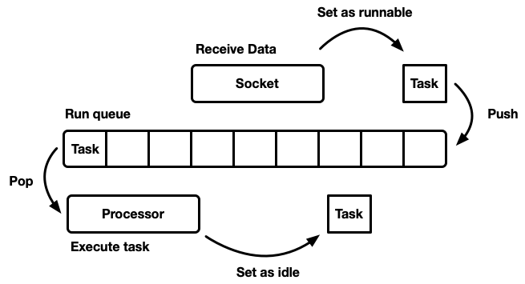
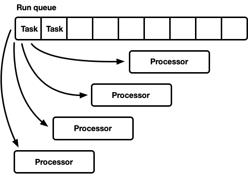
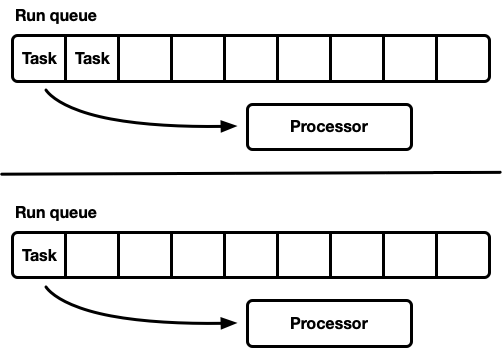
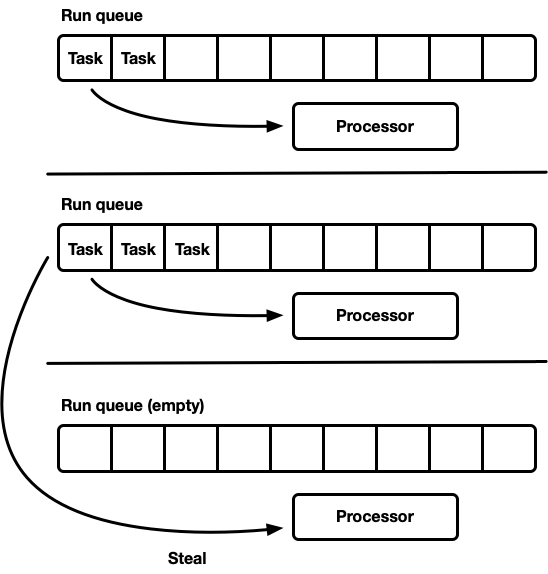

# Making the Tokio scheduler 10x faster

我们一直在努力对 Tokio（Rust 的异步运行时）进行下一次重大修订。今天，调度程序的完整重写已作为[拉取请求](https://github.com/tokio-rs/tokio/pull/1657)提交。结果是性能和延迟大幅改善。一些基准测试显示速度提高了 10 倍！这些改进对“全栈”用例的影响有多大始终不清楚，所以我们还测试了这些调度程序改进如何影响 [Hyper](https://github.com/hyperium/hyper/) 和 [Tonic](https://github.com/hyperium/tonic) 等用例（剧透：它真的很好）。

在准备开发新调度程序时，我花了很多时间搜索有关调度程序实现的资源。除了现有的实现之外，我没有找到太多资料。我还发现现有实现的来源很难找到。为了解决这个问题，我尝试让 Tokio 的新调度程序实现尽可能简洁。我还写了这篇关于实现调度程序的详细文章，希望其他有类似情况的人会觉得它有用。

本文首先从高层概述了调度程序设计，包括工作窃取调度程序。然后详细介绍了新 Tokio 调度程序中所做的具体优化。

涵盖的优化包括：

- [新的 `std::future` 任务系统](https://tokio.rs/blog/2019-10-scheduler#the-new-task-system)
- [选择更好的队列算法](https://tokio.rs/blog/2019-10-scheduler#a-better-run-queue)
- [优化消息传递模式](https://tokio.rs/blog/2019-10-scheduler#optimizing-for-message-passing-patterns)
- [窃取阀](https://tokio.rs/blog/2019-10-scheduler#throttle-stealing)
- [减少跨线程同步](https://tokio.rs/blog/2019-10-scheduler#reducing-cross-thread-synchronization)
- [减少分配](https://tokio.rs/blog/2019-10-scheduler#reducing-allocations)
- [减少原子引用计数](https://tokio.rs/blog/2019-10-scheduler#reducing-atomic-reference-counting)

主要主题是“减少”。毕竟，没有比没有代码更快的代码！

本文还介绍了如何[测试新的调度程序](https://tokio.rs/blog/2019-10-scheduler#fearless-unsafe-concurrency-with-loom)。编写正确、并发、无锁的代码确实很难。慢而正确总比快而错误多要好，尤其是当这些错误与内存安全有关时。但最好的选择是快速而正确，所以我们编写了 [`loom`](https://github.com/carllerche/loom/)，一个用于测试并发的工具。

在开始之前，我想表达一些谢意。

- [@withoutboats](https://github.com/withoutboats) 和其他参与 Rust `async` / `await` 功能开发的人。你们干得很棒。这是一个杀手级功能。
- [@cramertj](https://github.com/cramertj) 和其他设计 `std::task` 的人。与我们之前相比，这是一个巨大的进步。而且，他们做得很棒。
- [Buoyant](https://buoyant.io/)，[Linkerd](https://linkerd.io/) 的创造者，还是我的雇主。感谢你们让我花这么多时间在这项工作上。需要服务网格的读者可以看看 [Linkerd](https://linkerd.io/)。它很快就会包含本文讨论的所有优点。
- [Go](https://golang.org/) 的好的调度程序实现。

## Schedulers, how do they work?

调度程序的作用是安排工作。应用程序被分解为工作单元，我们将其称为任务。当任务可以继续执行时，它处于可运行状态；当任务被外部资源阻塞时，它不再处于可运行状态（或空闲状态）。任务是独立的，因为任意数量的可运行任务都可以同时执行。调度程序负责执行处于运行状态的任务，直到它们转换回空闲状态。执行任务意味着为任务分配 CPU 时间（全局资源）。

本文讨论了用户空间调度程序，即在操作系统线程之上运行的调度程序（而操作系统线程又由内核空间调度程序提供支持）。Tokio 调度程序执行 Rust Future，可以将其视为“异步绿色线程”。这是 [M:N 线程](https://en.wikipedia.org/wiki/Thread_(computing)#M:N_(hybrid_threading))模式，其中许多用户空间任务在少数操作系统线程上进行多路复用。

对调度程序进行建模的方法有很多种，每种方法都有其优点和缺点。从最基本的层面上讲，调度程序可以建模为运行队列和清空队列的处理器。处理器是在线程上运行的一段代码。在伪代码中，它执行以下操作：

```rust
while let Some(task) = self.queue.pop() {
    task.run();
}
```

当任务可运行时，它将被插入到运行队列中。



虽然可以设计一个资源、任务和处理器都存在于单个线程上的系统，但 Tokio 选择使用多个线程。我们生活在一个计算机配备多个 CPU 的世界。设计单线程调度程序会导致硬件利用率不足。我们希望使用所有 CPU。有几种方法可以做到这一点：

- 一个全局运行队列，多个处理器。
- 许多处理器，每个处理器都有自己的运行队列。

## One queue, many processors

在这个模型中，有一个单一的全局运行队列。当任务变为可运行时，它们被推送到队列的尾部。有多个处理器，每个处理器都在一个单独的线程上运行。每个处理器都会从队列头部弹出，如果没有可用任务则阻止该线程。



运行队列必须同时支持多生产者和多消费者，常用的算法是[侵入式](https://stackoverflow.com/questions/5004162/what-does-it-mean-for-a-data-structure-to-be-intrusive)链表。侵入式意味着任务结构包含指向运行队列中下一个任务的指针，而不是用链接列表节点包装任务。这样，就避免了 push 和 pop 操作的分配。可以使用[无锁 push 操作](http://www.1024cores.net/home/lock-free-algorithms/queues/intrusive-mpsc-node-based-queue)，但 pop 操作需要[^1] 互斥锁来协调消费者。

[^1]：从技术上讲，实现无锁多消费者队列是可能的。然而，在实践中，正确避免锁定所需的开销比仅仅使用互斥锁要大。

在实现通用线程池时通常使用此方法，因为它具有以下几个优点：

- 任务调度很公平。
- 实现起来相对简单。现成的队列可以与上面概述的处理器循环配对。

> 关于公平性的简要说明。调度公平性意味着任务按先进先出的原则进行调度。最先转换为运行的任务将最先执行。通用调度程序试图做到公平，但也存在一些用例，例如使用 fork-join 进行并行计算，其中唯一重要的因素是最终结果的计算速度，而不是每个单独的子任务的公平性。

这种调度模型有一个缺点。所有处理器都在争抢队列的头部。对于通用线程池来说，这通常不是什么大问题。处理器执行任务所花的时间远远超过从运行队列中弹出任务所花的时间。当任务执行时间较长时，队列争用会减少。但是，Rust 的异步任务从运行队列中弹出时预计执行时间非常短。在这种情况下，队列竞争的开销变得非常大。

## Concurrency and mechanical sympathy.

为了从程序中获得最佳的运行时性能，我们必须设计它以充分利用硬件的运行方式。"mechanical sympathy" 一词由 [Martin Thompson](https://mechanical-sympathy.blogspot.com/) 应用于软件（他的博客虽然不再更新，但仍然包含许多相关知识）。

关于现代硬件如何处理并发的详细讨论超出了本文的范围。从 10,000 英尺的高度来看，硬件性能的提高并不是通过速度变快，而是通过为应用程序提供更多的 CPU 内核（我的笔记本电脑有 6 个！）。每个核心可以在极短的时间内完成大量计算。相对而言，缓存和内存访问等操作需要的时间要[长得多](https://web.archive.org/web/20200225202909/https://www.prowesscorp.com/computer-latency-at-a-human-scale/)。因此，为了让应用程序运行得更快，我们必须最大限度地增加每次内存访问的 CPU 指令数量。虽然编译器可以为我们做很多工作，但作为开发人员，我们确实需要考虑结构布局和内存访问模式等问题。

当谈到并发线程时，行为与单个线程非常相似，直到请求同一个缓存行或[请求顺序一致性](https://en.cppreference.com/w/cpp/atomic/memory_order#Sequentially-consistent_ordering)为止。然后，[CPU 的缓存一致性协议](https://en.wikipedia.org/wiki/MESI_protocol)必须开始工作，以确保每个 CPU 的缓存保持最新。

显而易见的是：尽可能避免跨线程同步，因为它很慢。

## Many processors, each with their own run queue

另一种建模调度程序的方法是使用多个单线程调度程序。每个处理器都有自己的运行队列，任务被固定到特定的处理器。这完全避免了同步问题。由于 Rust 的任务模型需要能够从任何线程排队任务，因此仍然需要一种线程安全的方法将任务注入调度程序。每个处理器的运行队列都支持线程安全 push 操作（MPSC），或者每个处理器都有两个运行队列：一个非同步队列和一个线程安全队列。



这是 [Seastar](http://seastar.io/) 使用的策略。由于几乎完全避免了同步，因此该策略可以非常快。然而，它并不是灵丹妙药。除非工作负载完全均匀，否则一些处理器将处于空闲状态，而其他处理器则处于负载状态，从而导致资源利用不足。这是因为任务被固定到特定处理器。当单个处理器上的一组任务被分批调度时，即使其他处理器处于空闲状态，该单个处理器也负责处理峰值。

大多数“现实世界”的工作负载并不统一。因此，通用调度程序倾向于避免使用这种模型。

## Work-stealing scheduler

工作窃取调度程序建立在分片调度程序模型之上，解决了利用率不足的问题。每个处理器都维护自己的运行队列。可运行的任务被推送到当前处理器的运行队列，并且处理器清空其本地运行队列。但是，当处理器空闲时，它会检查同级处理器运行队列并尝试从中窃取任务。只有当处理器无法从同级运行队列中找到任务时，它才会进入休眠状态。



在模型层面，这是一种“两全其美”的方法。在负载下，处理器独立运行，避免了同步开销。如果负载在处理器之间分布不均匀，则调度程序能够重新分配。由于这一特性，工作窃取调度程序是 [Go](https://golang.org/)、[Erlang](https://github.com/erlang/otp/blob/17845f5a18f43b16ecafd1a9f9d289fddee54afd/erts/emulator/beam/erl_process.c)、[Java](https://docs.oracle.com/javase/8/docs/api/java/util/concurrent/ForkJoinPool.html) 等语言的选择。

缺点是这种方法要复杂得多；运行队列算法必须支持窃取操作，并且需要一些跨处理器同步才能保持顺利运行。如果操作不正确，实现工作窃取模型的开销可能会大于所获得的收益。

考虑这种情况：处理器 A 当前正在运行一项任务，并且有一个空的运行队列。处理器 B 处于空闲状态；它试图窃取任务但失败了，因此进入休眠状态。然后，处理器 A 正在执行的任务生成了 20 个任务。目标是唤醒处理器 B 并窃取一些新产生的任务。为了实现这一点，工作窃取调度程序需要一些启发式方法，当处理器在队列中观察到新工作时，它们会向休眠的兄弟处理器发出信号。当然，这会引入额外的同步，因此必须尽量减少此操作。

总之：

- 最小化同步是好的。
- 工作窃取是通用调度程序的首选算法。
- 每个处理器大部分都是独立的，但窃取时需要一些同步。

## The Tokio 0.1 scheduler

Tokio 于 [2018 年 3 月](https://tokio.rs/blog/2018-03-tokio-runtime/)首次发布了其工作窃取调度程序。这是基于一些后来被证明是错误的假设的首次尝试。

首先，Tokio 0.1 调度程序假设处理器线程在闲置一段时间后应关闭。该调度程序最初旨在成为 Rust future 的“通用”线程池执行程序。首次编写调度程序时，Tokio 仍处于 "tokio-core" 时代。此时，模型是基于 I/O 的任务将在与 I/O selector（epoll、kqueue、iocp 等）共置的单个线程上执行。可以将更多 CPU 密集型工作转移到线程池。在这种情况下，活动线程的数量应该是灵活的，关闭空闲线程更有意义。然而，模型转向在工作窃取调度程序上运行所有异步任务，在这种情况下，保持少量线程始终处于活动状态更有意义。

其次，它使用了 [crossbeam](https://github.com/crossbeam-rs/crossbeam) 双端队列实现。此实现基于 [Chase-Lev 双端队列](https://www.dre.vanderbilt.edu/~schmidt/PDF/work-stealing-dequeue.pdf)，由于下文所述的原因，它不太适合调度独立异步任务的用例。

第三，实现过于复杂。部分原因是这是我的第一个调度程序实现。此外，我过于急于在代码路径中使用原子，而互斥锁本来就可以很好地完成任务。一个重要的教训是，在许多情况下，互斥锁是最佳选择。

最后，最初的实施过程中存在许多小的效率低下问题。Rust 异步模型的细节在早期发生了很大变化，但这些年来库一直保持着 API 的稳定性。这导致积累了一些债务，现在可以偿还了。

随着 tokio 即将发布其首张重大版本，我们可以用这些年来的经验教训来偿还所有债务。这是一个激动人心的时刻！

## The next generation Tokio scheduler

现在是时候深入研究新调度程序中的变化了。

### The new task system

首先，有必要强调一些不属于 Tokio 但对所取得的一些成果至关重要的东西：`std` 中包含的[新任务系统](https://doc.rust-lang.org/std/task/index.html)，主要由 [Taylor Cramer](https://github.com/cramertj) 设计。该系统提供了调度程序必须实现的钩子来执行 Rust 异步任务，而且做得非常好。它比上一个版本更轻量、更灵活。

Waker 结构由资源持有，用于表示任务可运行并被推送到调度程序的运行队列中。在新的任务系统中，Waker 结构是两个指针宽，而以前它要大得多。缩小尺寸非常重要，因为它可以最大程度地减少复制 Waker 值的开销，同时还可以减少结构中的空间，从而允许更多关键数据容纳在缓存行中。自定义 [vtable](https://doc.rust-lang.org/std/task/struct.RawWakerVTable.html) 设计可以实现许多优化，稍后将讨论。

### A better run queue

运行队列是调度程序的核心。因此，它可能是最需要正确处理的组件。最初的 Tokio 调度程序使用了 [crossbeam](https://github.com/crossbeam-rs/crossbeam) 的双端队列实现，即单生产者、多消费者双端队列。任务被推送到一端，值从另一端弹出。大多数情况下，push 的线程会 pop 它，但是，其他线程偶尔也会通过 pop 来“窃取”。双端队列由一个数组和一组跟踪头部和尾部的索引支持。当双端队列已满时，向其推送数据将导致存储空间增加。系统会分配一个新的、更大的数组，并将值移至新存储中。

双端队列的增长能力带来了复杂性和开销成本。push/pop 操作必须考虑到这种增长。此外，在增长时，释放原始数组会带来额外的困难。在垃圾收集语言中，旧数组会超出范围，最终 GC 会释放它。然而，Rust 没有 GC。这意味着我们负责释放数组，但线程可能正在同时访问内存。Crossbeam 对此的回答是使用[基于 epoch 的回收策略](https://aturon.github.io/blog/2015/08/27/epoch/#epoch-based-reclamation)。虽然成本不高，但它确实在热路径中增加了不小的开销。现在，每个操作在进入和退出关键部分时都必须发出原子 RMW（读取-修改-写入）操作，以向其他线程发出信号，表明内存正在使用中，并避免释放。

由于增加运行队列会产生成本，因此值得研究是否需要增加队列。这个问题最终促使我们重写了调度程序。新调度程序的策略是使用固定大小的每个进程队列。当队列已满时，任务将被推送到全局、多消费者、多生产者的队列中，而不是增加本地队列。处理器需要偶尔检查这个全局队列，但频率比本地队列低得多。

早期的实验用有界的 [mpmc](http://www.1024cores.net/home/lock-free-algorithms/queues/bounded-mpmc-queue) 队列替换了 crossbeam 队列。由于 push 和 pop 执行的同步量较大，因此这并没有带来太大的改进。关于工作窃取用例要记住的一个关键点是，在负载下，队列几乎没有争用，因为每个处理器只访问自己的队列。

此时，我选择仔细阅读 Go 源代码，发现他们使用了固定大小的单生产者、多消费者队列。这个队列令人印象深刻的是，它几乎不需要同步就能运行。我最终调整了算法以用于 Tokio 调度程序，并做了一些更改。值得注意的是，Go 实现对其原子操作使用了顺序一致性（基于我对 Go 的有限了解）。作为 Tokio 调度程序的一部分实现的版本还减少了一些不太常用的代码路径中的复制。

队列实现是一个循环缓冲区，使用数组来存储值。原子整数用于跟踪头部和尾部的位置。

```rust
struct Queue {
    /// Concurrently updated by many threads.
    head: AtomicU32,

    /// Only updated by producer thread but read by many threads.
    tail: AtomicU32,

    /// Masks the head / tail position value to obtain the index in the buffer.
    mask: usize,

    /// Stores the tasks.
    buffer: Box<[MaybeUninit<Task>]>,
}
```

push 到队列由单个线程完成：

```rust
loop {
    let head = self.head.load(Acquire);

    // safety: this is the **only** thread that updates this cell.
    let tail = self.tail.unsync_load();

    if tail.wrapping_sub(head) < self.buffer.len() as u32 {
        // Map the position to a slot index.
        let idx = tail as usize & self.mask;

        // Don't drop the previous value in `buffer[idx]` because
        // it is uninitialized memory.
        self.buffer[idx].as_mut_ptr().write(task);

        // Make the task available
        self.tail.store(tail.wrapping_add(1), Release);

        return;
    }

    // The local buffer is full. Push a batch of work to the global
    // queue.
    match self.push_overflow(task, head, tail, global) {
        Ok(_) => return,
        // Lost the race, try again
        Err(v) => task = v,
    }
}
```

请注意，在此 push 函数中，唯一的原子操作是使用 Acquire 顺序的加载和使用 Release 顺序的存储。没有读取-修改-写入操作（compare_and_swap、fetch_and 等）或顺序一致性。这一点很重要，因为在 x86 芯片上，所有加载/存储都已经是“原子”的。因此，在 CPU 级别，此[功能没有同步](https://www.justsoftwaresolutions.co.uk/threading/intel-memory-ordering-and-c++-memory-model.html)。使用原子操作会影响编译器，因为它会阻止某些优化，但仅此而已。第一次 `load` 很可能可以通过 `Relaxed` 排序安全地完成，但在切换时没有可衡量的收益。

当队列已满时，将调用 `push_overflow`。此函数将本地队列中的一半任务移至全局队列。全局队列是一个受互斥锁保护的侵入式链表。首先将移动到全局队列的任务链接在一起，然后获取互斥锁并通过更新全局队列的尾指针插入所有任务。这可以使临界区保持较小。

如果您熟悉原子内存排序的细节，您可能会注意到如上所示的 `push` 功能存在潜在的“问题”。具有 `Acquire` 顺序的原子 `load` 非常弱。它可能会返回陈旧的值，即并发的窃取操作可能已经增加了 `self.head` 的值，但是执行 `push` 的线程在缓存中有一个旧值，因此它没有注意到窃取操作。这对于算法的正确性来说不是问题，在 `push` 的 fast-path 中我们只关心本地运行队列是否满了。鉴于当前线程是唯一可以 push 到运行队列的线程，过时的 `load` 将导致运行队列比实际更满。可能会错误地判断队列已满而进入 `push_overflow` 函数，但是该函数包含了更强的原子操作。如果 `push_overflow` 确定队列实际上未满，则返回 w/ `Err`，然后再次尝试 `push` 操作。这也是 `push_overflow` 将一半运行队列移至全局队列的另一个原因。通过移动一半的队列，“运行队列为空”的误报发生的频率大大降低。

本地 `pop`（来自拥有队列的处理器）也很轻：

```rust
loop {
    let head = self.head.load(Acquire);

    // safety: this is the **only** thread that updates this cell.
    let tail = self.tail.unsync_load();

    if head == tail {
        // queue is empty
        return None;
    }

    // Map the head position to a slot index.
    let idx = head as usize & self.mask;

    let task = self.buffer[idx].as_ptr().read();

    // Attempt to claim the task read above.
    let actual = self
        .head
        .compare_and_swap(head, head.wrapping_add(1), Release);

    if actual == head {
        return Some(task.assume_init());
    }
}
```

在此函数中，有一个原子 load 和一个带有 release 的 `compare_and_swap`。主要开销来自 `compare_and_swap`。

`steal` 函数与 `pop` 函数类似，但是来自 `self.tail` 的 load 必须是原子的。此外，与 `push_overflow` 类似，steal 操作将尝试获取队列的一半，而不是单个任务。这有一些很好的特性，我们将在后面介绍。

最后缺少的部分是使用全局队列。此队列用于处理来自处理器本地队列的溢出以及从非处理器线程向调度程序提交任务。如果处理器处于负载状态，即本地运行队列中有任务。处理器将在执行本地队列中约 60 个任务后尝试从全局队列中弹出。当处于“搜索”状态时，它还会检查全局队列，如下所述。

### Optimizing for message passing patterns

使用 Tokio 编写的应用程序通常由许多小型独立任务组成。这些任务将使用消息传递相互通信。这种模式类似于 Go 和 Erlang 等其他语言。考虑到这种模式的常见程度，调度程序尝试对其进行优化是有意义的。

给定任务 A 和任务 B。任务 A 当前正在执行，并通过通道向任务 B 发送消息。该通道是任务B当前被阻塞的资源，因此发送消息的动作将导致任务B转换为可运行状态，并被推入当前处理器的运行队列。然后，处理器将从运行队列中弹出下一个任务，执行它，并重复，直到到达任务 B。

问题在于，消息发送和任务 B 执行之间可能会存在相当大的延迟。此外，“热”数据（例如消息）在发送时会存储在 CPU 的缓存中，但在任务 B 被调度时，相关缓存很可能已被清除。

为了解决这个问题，新的 Tokio 调度程序实现了优化（在 Go 和 Kotlin 的调度程序中也可以找到）。当任务转换为可运行状态时，它不会被推到运行队列的后面，而是被存储在特殊的“下一个任务”槽中。处理器总是在检查运行队列之前检查此槽位。当将任务插入此槽位时，如果其中已存储有任务，则将旧任务从槽位中移除并推到运行队列的后面。在消息传递情况下，这将导致消息的接收者被安排接下来运行。

### Throttle stealing

在工作窃取调度程序中，当处理器的运行队列为空时，该处理器将尝试从兄弟处理器窃取任务。为此，会选择一个随机同级任务作为起点，然后处理器对该同级任务执行窃取操作。如果没有找到任务，则尝试下一个同级任务，依此类推，直到找到任务。

实际上，许多处理器通常大约在同一时间完成其运行队列的处理。当一批工作到达时会发生这种情况（例如当 epoll 轮询套接字是否就绪时）。处理器被唤醒，获取任务，运行任务，然后完成。这会导致所有处理器同时尝试窃取，这意味着许多线程尝试访问相同的队列。这会产生争用。随机选择起点有助于减少争用，但结果仍然很糟糕。

为了解决这个问题，新的调度程序限制了执行窃取操作的并发处理器的数量。我们将处理器试图窃取的处理器状态称为“寻找工作”，或者简称为“搜索”状态（稍后会讲到）。此优化通过一个原子 int 来实现，处理器在开始搜索之前会将其递增，在退出搜索状态时会将其递减。搜索器的最大数量是处理器总数的一半。话虽如此，这个限制还是有点草率，但没关系。我们不需要对搜索者的数量进行严格限制，只需要节流。我们用精确度换取算法效率。

一旦进入搜索状态，处理器就会尝试从兄弟工作者那里窃取并检查全局队列。

### Reducing cross thread synchronization

工作窃取调度程序的另一个关键部分是同级通知。处理器在观察到新任务时会通知同级。如果同级处于休眠状态，它会被唤醒并窃取任务。通知操作还有另一项重要职责。回想一下，队列算法使用了弱原子排序（Acquire / Release）。由于原子内存排序的工作方式，如果没有额外的同步，就无法保证兄弟处理器一定会看到队列中要窃取的任务。通知操作还负责建立必要的同步，以便兄弟处理器能够看到任务并窃取它们。这些要求使得通知操作代价高昂。目标是尽可能少地执行通知操作，而不会导致 CPU 利用率不足，即处理器有任务，而兄弟处理器无法窃取这些任务。过于急切的通知会导致惊群效应。

最初的 Tokio 调度程序采用了一种简单的通知方法。每当有新任务被推送到运行队列时，处理器都会收到通知。每当处理器被通知并在唤醒时发现任务时，它就会通知另一个处理器。这种逻辑很快导致所有处理器被唤醒并搜索工作（导致争用）。通常，大多数处理器都找不到工作并重新进入睡眠状态。

新的调度程序借用了 Go 调度程序中使用的相同技术，显著改进了这一点。通知尝试在与前一个调度程序相同的点进行，但是，仅当没有工作者处于搜索状态时才会发生通知（请参阅上一节）。当一个 worker 被通知后，它会立即转换到搜索状态。当处于搜索状态的处理器发现新任务时，它会先转换出搜索状态，然后通知另一个处理器。

此逻辑具有限制处理器唤醒速率的效果。如果一次安排一批任务（例如，当 epoll 轮询套接字是否就绪时），则第一个任务将导致通知处理器。该处理器现在处于搜索状态。批次中的其余调度任务不会通知处理器，因为至少有一个处理器处于搜索状态。收到通知的处理器将窃取批处理中的一半任务，然后通知另一个处理器。第三个处理器将被唤醒，从前两个处理器之一中找到任务并窃取其中的一半。这使得处理器能够平稳提升，并且任务能够快速负载平衡。

### Reducing allocations

新的 Tokio 调度程序只需要为每个生成的任务分配一次，而旧调度程序则需要两次。以前，Task 结构看起来像这样：

```rust
struct Task {
    /// All state needed to manage the task
    state: TaskState,

    /// The logic to run is represented as a future trait object.
    future: Box<dyn Future<Output = ()>>,
}
```

然后 `Task` 结构也会被分配到 `Box` 中。这一直是我很久以来想修复的一个缺陷（我[第一次尝试](https://github.com/carllerche/astaire/blob/6b612e8f614f7351257e2957bd9092aea9ac3781/src/core/cell.rs#L205-L217)修复它是在 2014 年）。自旧版 Tokio 调度程序以来，有两件事发生了变化。首先，`std::alloc` 稳定了。其次，Future 任务系统切换到了显式 [vtable 策略](https://doc.rust-lang.org/std/task/struct.RawWakerVTable.html)。这是最终摆脱每个任务双重分配低效率所需要的两个缺失的部分。

现在，`Task` 结构表示为：

```rust
struct Task<T> {
    header: Header,
    future: T,
    trailer: Trailer,
}
```

`Header` 和 `Trailer` 都是完成任务所需的状态，但它们被分为“热”数据（header）和“冷”数据（trailer），即，大致是经常访问的数据和很少使用的数据。热数据放在结构的头部，并尽可能保持较小。当 CPU 取消引用任务指针时，它将一次加载缓存行大小的数据量（[64 到 128 字节](https://lwn.net/Articles/252125/)之间）。我们希望这些数据尽可能相关。

### Reducing atomic reference counting

我们将在本文中讨论的最后一个优化是新调度程序如何减少所需的原子引用计数的数量。关于任务结构有许多未解决的参考：调度程序和每个唤醒程序都持有一个句柄。管理此内存的常用方法是使用[原子引用计数](https://doc.rust-lang.org/std/sync/struct.Arc.html)。此策略要求每次复制引用时都执行原子操作，每次删除引用时也执行原子操作。当最终引用超出范围时，内存将被释放。

在旧的 Tokio 调度程序中，每个唤醒程序都持有对任务句柄的计数引用，大致如下：

```rust
struct Waker {
    task: Arc<Task>,
}

impl Waker {
    fn wake(&self) {
        let task = self.task.clone();
        task.scheduler.schedule(task);
    }
}
```

当任务被唤醒时，引用被复制（原子增量）。然后引用被 push 到运行队列中。当处理器收到任务并执行完毕后，它会删除引用，从而产生原子减量。这些原子操作会累加起来。

`std::future` 任务系统的设计人员之前已经发现了这个问题。据观察，当调用 Waker::wake 时，通常不再需要原始唤醒程序引用。这允许在将任务 push 到运行队列时重用原子引用计数。`std::future` 任务系统现在包含两个“唤醒”API：

- [`wake`](https://doc.rust-lang.org/std/task/struct.Waker.html#method.wake) 使用 `self`
- [`wake_by_ref`](https://doc.rust-lang.org/std/task/struct.Waker.html#method.wake_by_ref) 使用 `&self`

此 API 设计促使调用者使用 `wake`，从而避免了原子增量。现在的实现变为：

```rust
impl Waker {
    fn wake(self) {
        task.scheduler.schedule(self.task);
    }

    fn wake_by_ref(&self) {
        let task = self.task.clone();
        task.scheduler.schedule(task);
    }
}
```

仅当可以取得 waker 的所有权才能唤醒时，这才可以避免额外引用计数的开销。根据我的经验，使用 &self 唤醒几乎总是更可取的。使用 `self` 唤醒可以防止重复使用 waker（在资源发送许多值（即通道、套接字等）的情况下很有用）当需要 `self` 时，实现线程安全唤醒也更加困难（这方面的细节将留待另一篇文章讨论）。

新的调度程序端通过避免 `wake_by_ref` 中的原子增量来解决整个 "wake by `self`" 问题，使其与 `wake(self)` 一样高效。这是通过让调度程序维护当前活动（尚未完成）的所有任务的列表来实现的。此列表表示将任务 push 到运行队列所需的引用计数。

这种优化的难点在于确保调度程序不会从其列表中删除任何任务，直到可以保证该任务不会再次被推入运行队列。关于如何管理这一点的具体细节超出了本文的范围，但我建议您在源代码中进一步调查这一点。

### Fearless (unsafe) concurrency with Loom

编写正确、并发、无锁的代码确实很难。慢而正确总比快而错误多多要好，尤其是当这些错误与内存安全有关时。最好的选择是快速而正确。新调度程序进行了一些相当积极的优化，并避免了大多数 `std` 类型，以便编写更专业的版本。新调度程序中有相当多的 `unsafe` 代码。

测试并发代码有几种方法。一种是让用户为您进行测试和调试（当然，这是一个有吸引力的选择）。另一种是编写循环运行的单元测试，并希望它能发现错误。甚至可能加入 [TSAN](https://clang.llvm.org/docs/ThreadSanitizer.html)。当然，如果确实发现了错误，则没有办法轻松地重现它，除非再次循环运行测试。另外，你运行这个循环多长时间？十秒？十分钟？十天？这曾经是用 Rust 测试并发代码的状态。

我们认为现状是不可接受的。我们希望在发布代码时充满信心（好吧，尽可能充满信心），尤其是并发、无锁代码。可靠性是 Tokio 用户所期望的。

为了满足我们的需求，我们编写了一个新工具：[Loom](https://github.com/carllerche/loom/)。Loom 是一个用于并发代码的排列测试工具。测试像平常一样编写，但是当使用 `loom` 执行时，`loom` 将多次运行测试，排列测试在线程环境中可能遇到的所有可能的执行和行为。它还验证正确的内存访问、释放内存等……

作为示例，下面是针对新调度程序的 loom 测试：

```rust
#[test]
fn multi_spawn() {
    loom::model(|| {
        let pool = ThreadPool::new();

        let c1 = Arc::new(AtomicUsize::new(0));

        let (tx, rx) = oneshot::channel();
        let tx1 = Arc::new(Mutex::new(Some(tx)));

        // Spawn a task
        let c2 = c1.clone();
        let tx2 = tx1.clone();
        pool.spawn(async move {
            spawn(async move {
                if 1 == c1.fetch_add(1, Relaxed) {
                    tx1.lock().unwrap().take().unwrap().send(());
                }
            });
        });

        // Spawn a second task
        pool.spawn(async move {
            spawn(async move {
                if 1 == c2.fetch_add(1, Relaxed) {
                    tx2.lock().unwrap().take().unwrap().send(());
                }
            });
        });

        rx.recv();
    });
}
```

它看起来很正常，但同样，`loom::model` 块中的代码段要运行数千次（可能数百万次），每次的行为都会略有不同。线程的确切顺序每次都会发生变化。此外，对于每个原子操作，`loom` 都会尝试 C++11 内存模型允许的所有不同行为。回想一下，我之前提到过，使用 `Acquire` 进行原子 load 相当弱，可能会返回过时的值。`loom` 测试将尝试所有可以加载的值。

在开发新调度程序时，loom 是一款非常有用的工具。它捕获了其他单元测试、手动测试和压力测试遗漏的 10 多个错误。

精明的读者可能会质疑 loom 测试“所有可能的排列”的说法，并且这样做是正确的。行为的简单排列将导致因子级别的组合爆炸。任何非平凡的测试都无法完成。这个问题已经研究了很多年，并且存在许多算法来管理组合爆炸。Loom 的核心算法基于[动态偏序缩减](https://users.soe.ucsc.edu/~cormac/papers/popl05.pdf)。该算法能够删除导致相同执行的排列。即使如此，状态空间也可能变得太大而无法在合理的时间内（几分钟）完成。Loom 还允许使用动态偏序缩减的有界变体来限制搜索空间。

总而言之，由于使用 loom 进行了广泛的测试，我对调度程序的正确性更加有信心。

## The results

那么，现在我们已经了解了调度程序是什么以及新的 Tokio 调度程序如何实现巨大的性能提升......这些提升到底是什么？由于新调度程序非常新，因此尚未进行广泛的实际测试。以下是我们所知道的内容。

首先，新调度程序在微基准测试中速度更快。以下是新调度程序在某些基准测试中的改进情况。

**Old scheduler**

```shell
test chained_spawn ... bench:   2,019,796 ns/iter (+/- 302,168)
test ping_pong     ... bench:   1,279,948 ns/iter (+/- 154,365)
test spawn_many    ... bench:  10,283,608 ns/iter (+/- 1,284,275)
test yield_many    ... bench:  21,450,748 ns/iter (+/- 1,201,337)
```

**New scheduler**

```shell
test chained_spawn ... bench:     168,854 ns/iter (+/- 8,339)
test ping_pong     ... bench:     562,659 ns/iter (+/- 34,410)
test spawn_many    ... bench:   7,320,737 ns/iter (+/- 264,620)
test yield_many    ... bench:  14,638,563 ns/iter (+/- 1,573,678)
```

基准包括：

- `chained_spawn` 测试递归地生成一个新任务，即生成一个任务，生成一个任务，生成一个任务，……
- `ping_pong` 分配一个 `oneshot` 通道，生成一个在该通道上发送消息的任务。原始任务等待接收该消息。这是最接近“真实世界”的基准。
- `spawn_many` 测试将任务注入调度程序，即从调度程序上下文之外生成任务。
- `yield_many` 测试任务自我唤醒。

从旧调度程序到新调度程序的改进非常令人印象深刻。但是，这些改进如何延续到“现实世界”中呢？很难确切地说，但我确实尝试使用新调度程序运行 [Hyper](https://github.com/hyperium/hyper/) 基准测试。

这是使用 `wrk -t1 -c50 -d10` 进行基准测试的 "hello world" Hyper 服务器：

**Old scheduler**

```shell
Running 10s test @ http://127.0.0.1:3000
  1 threads and 50 connections
  Thread Stats   Avg      Stdev     Max   +/- Stdev
    Latency   371.53us   99.05us   1.97ms   60.53%
    Req/Sec   114.61k     8.45k  133.85k    67.00%
  1139307 requests in 10.00s, 95.61MB read
Requests/sec: 113923.19
Transfer/sec:      9.56MB
```

**New scheduler**

```shell
Running 10s test @ http://127.0.0.1:3000
  1 threads and 50 connections
  Thread Stats   Avg      Stdev     Max   +/- Stdev
    Latency   275.05us   69.81us   1.09ms   73.57%
    Req/Sec   153.17k    10.68k  171.51k    71.00%
  1522671 requests in 10.00s, 127.79MB read
Requests/sec: 152258.70
Transfer/sec:     12.78MB
```

仅通过切换调度程序，每秒的请求量就增加了 34%！当我第一次看到这个时，我非常高兴。我原本预计增幅约为 5% 至 10%。然后我很难过，因为这也意味着旧的 Tokio 调度程序不是那么好，但是没关系。然后我想起 Hyper 已经在 [TechEmpower](https://www.techempower.com/benchmarks/#section=data-r18&hw=ph&test=plaintext) 基准测试中名列前茅。我很期待看到新的调度程序将如何影响这些排名。

[Tonic](https://github.com/hyperium/tonic) 是一个 gRPC 客户端和服务器，其速度提高了约 10%，考虑到 Tonic 尚未高度优化，这个速度相当令人印象深刻。

## Conclusion

我真的很兴奋终于完成了这项工作。这项工作已经进行了几个月，将成为 Rust 异步 I/O 历史上的一大进步。我对新调度程序工作已经展现出的改进非常满意。Tokio 代码库中还有许多地方可以加速，因此这项新调度程序工作并不是性能方面的终点。

我还希望本文提供的详细信息能够对其他尝试编写调度程序的人有所帮助。
