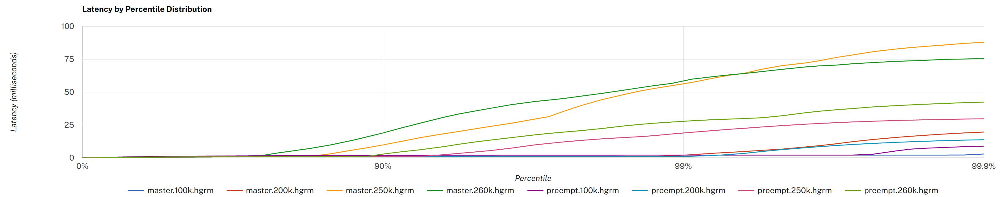

# Reducing tail latencies with automatic cooperative task yielding

Tokio 是异步 Rust 应用程序的运行时。它允许使用 `async` 和 `await` 语法编写代码。例如：

```rust
let mut listener = TcpListener::bind(&addr).await?;

loop {
    let (mut socket, _) = listener.accept().await?;

    tokio::spawn(async move {
        // handle socket
    });
}
```

Rust 编译器将此代码转换为状态机。Tokio 运行时执行这些状态机，在少数线程上多路复用许多任务。Tokio 的调度程序要求生成的任务的状态机将控制权交还给调度程序，以便多路复用任务。每次 .await 调用都是一次将控制权交还给调度程序的机会。在上面的例子中，如果有套接字处于待处理状态，listener.accept().await 将返回一个套接字。如果没有待处理的套接字，则将控制权交还给调度程序。

在大多数情况下，该系统运行良好。但是，当系统处于负载状态时，异步资源可能始终处于就绪状态。例如，考虑一个 echo 服务器：

```rust
tokio::spawn(async move {
    let mut buf = [0; 1024];

    loop {
        let n = socket.read(&mut buf).await?;

        if n == 0 {
            break;
        }

        // Write the data back
        socket.write(buf[..n]).await?;
    }
});
```

如果数据的接收速度比处理速度快，那么在数据块处理完成时可能已经接收到更多的数据。在这种情况下，.await 永远不会将控制权交还给调度程序，其他任务将不会被安排，从而导致饥饿和较大的延迟差异。

目前，这个问题的答案是 Tokio 的用户负责在应用程序和库中添加[让出点](https://docs.rs/tokio/0.2/tokio/task/fn.yield_now.html)。实际上，很少有人真正这样做，最终容易受到此类问题的困扰。

解决此问题的一个常见方法是抢占。对于普通操作系统线程，内核会时不时中断执行，以确保所有线程的公平调度。对执行具有完全控制权的运行时（Go、Erlang 等）也将使用抢占来确保任务的公平调度。这是通过在编译时注入让出点（检查任务是否已执行足够长的时间并如果是则返回给调度程序的代码）来实现的。不幸的是，Tokio 无法使用这种技术，因为 Rust 的 `async` 生成器没有为 executor（如 Tokio）提供任何机制来注入此类让出点。

## Per-task operation budget

尽管 Tokio 无法抢占，仍然有机会推动任务重新回到调度程序。从 [0.2.14](https://github.com/tokio-rs/tokio/releases/tag/tokio-0.2.14) 开始，每个 Tokio 任务都有一个操作预算。当调度程序切换到任务时，此预算会被重置。每个 Tokio 资源（套接字、计时器、通道等）都知道这个预算。只要任务有剩余预算，资源就会像以前一样运行。每个异步操作（用户必须 `await` 的操作）都会减少任务的预算。一旦任务超出预算，所有 Tokio 资源将永久返回“未准备好”，直到任务返回到调度程序。此时，预算将被重置，Tokio 资源上的 future 的 `.await` 将再次正常运行。

让我们回到上面的 echo 服务器示例。当任务被调度时，它被分配了 128 个 per "tick" 操作的预算。选择数字 128 主要是因为它感觉良好并且似乎与我们测试的情况（[Noria](https://github.com/mit-pdos/noria) 和 HTTP）配合良好。当调用 `socket.read(..)` 和 `socket.write(..)` 时，预算会减少。如果预算为零，则任务将交还给调度程序。如果由于底层套接字未准备好（没有待处理数据或发送缓冲区已满）而导致 `read` 或 `write` 无法继续，则该任务也会返回到调度程序。

这个想法源自我与 [Ryan Dahl](https://github.com/ry) 的一次对话。他正在使用 Tokio 作为 [Deno](https://github.com/denoland/deno) 的底层运行时。前段时间，当他使用 [Hyper](https://github.com/hyperium/hyper/) 进行 HTTP 实验时，他发现一些基准测试中的尾部延迟较高。该问题是由于循环在负载下没有返回调度程序而导致的。在这种情况下，Hyper 最终手动[修复](https://github.com/hyperium/hyper/pull/1829)了该问题，但 Ryan 提到，当他在 [node.js](https://nodejs.org/) 上工作时，他们通过添加每个资源限制来处理该问题。因此，如果 TCP 套接字始终处于就绪状态，它会时不时地强制让出。我向 [Jon Gjenset](https://github.com/jonhoo/) 提到了这次谈话，他提出了将限制放在任务本身而不是每个资源上的想法。

最终结果是 Tokio 应该能够在负载下提供更一致的运行时行为。虽然确切的启发式方法很可能会随着时间的推移而进行调整，但初步测量表明，在某些情况下，尾部延迟减少了近 3 倍。



“master” 在自动让权之前，“preempt” 在自动让权之后。单击可查看大图，另请参阅原始 [PR 评论](https://github.com/tokio-rs/tokio/pull/2160#issuecomment-579004856)以了解更多详细信息。

## A note on blocking

虽然自动协作任务让步在许多情况下可以提高性能，但它无法抢占任务。Tokio 的用户仍必须小心避免 CPU 密集型工作和阻塞 API。[`spawn_blocking`](https://docs.rs/tokio/0.2/tokio/task/fn.spawn_blocking.html) 函数可用于“异步化”这些类型的任务，通过在允许阻塞的线程池上运行它们。

Tokio 不会、也不会尝试检测阻塞任务并通过向调度程序添加线程来自动补偿。这个问题在过去出现过很多次，所以请允许我详细说明一下。

就上下文而言，我们的想法是让调度程序包含一个监控线程。该线程会不时轮询调度程序线程并检查工作程序是否正在取得进展。如果一个工作者没有取得进展，则假定该工作者正在执行阻塞任务，并且应该生成一个新线程来补偿。

这个想法并不新鲜。据我所知，这种策略第一次出现是在 .NET 线程池中，并且是在十多年前引入的。不幸的是，该策略存在许多问题，因此它尚未在其他线程池/调度程序（Go，Java，Erlang 等）中出现。

第一个问题是很难定义“进度”。进度的一个简单定义是任务是否已安排在某个时间单位内。例如，如果一个工作者在调度同一项任务时卡住了超过 100 毫秒，那么该工作者将被标记为阻塞并且会生成一个新线程。在这个定义中，如何检测产生新线程导致吞吐量降低的情况？当调度程序通常处于负载状态并且添加线程会使情况变得更糟时，就会发生这种情况。为了解决这个问题，.NET 线程池使用[爬山法](https://en.wikipedia.org/wiki/Hill_climbing)。[本文](https://mattwarren.org/2017/04/13/The-CLR-Thread-Pool-Thread-Injection-Algorithm/)很好地概述了它的工作原理。

第二个问题是，任何自动检测策略都容易受到突发或其他不均匀工作负载的影响。这个特定的问题一直是 .NET 线程池的祸根，被称为[“卡顿”问题](http://joeduffyblog.com/2006/07/08/clr-thread-pool-injection-stuttering-problems/)。爬山策略需要一段时间（数百毫秒）来适应负载变化。需要这段时间，部分是为了确定添加线程是否会改善情况，而不是使情况变得更糟。

.NET 线程池可以部分解决卡顿问题，因为该线程池被设计用于调度粗任务，即以数百毫秒到数秒的量级执行的任务。然而，在 Rust 中，异步任务调度器被设计用于调度应该以微秒到最多几十毫秒的量级运行的任务。在这种情况下，基于启发式的调度程序的任何卡顿问题都将导致更大的延迟变化。

此后我收到的最常见的后续问题是“Go 调度程序不会自动检测被阻止的任务吗？”。简短的回答是：不行。这样做会导致与上述相同的卡顿问题。此外，Go 不需要具有通用的阻塞任务检测，因为 Go 能够抢占。Go 调度程序所做的就是注释潜在的阻塞系统调用。这大致相当于 Tokio 的 [`block_in_place`](https://docs.rs/tokio/0.2/tokio/task/fn.block_in_place.html)。

简而言之，到目前为止，刚刚引入的自动协作任务让步策略是我们发现的减少尾部延迟的最佳策略。由于该策略仅要求 Tokio 的类型选择加入，因此最终用户无需更改任何内容即可获得此好处。只需升级 Tokio 版本即可包含此新功能。此外，如果 Tokio 的类型在 Tokio 运行时之外使用，它们的行为将与以前一样。

关于这个主题还有更多的工作要做。目前还不清楚任务预算应该如何与“子调度程序”（例如 [`FuturesUnordered`](https://docs.rs/futures/0.3.4/futures/stream/struct.FuturesUnordered.html)）协同工作。任务预算 API 最终应该公开，以便第三方库可以与它们集成。找到一种方法来推广这一概念，让不仅仅是 Tokio 用户可以利用它，这也是一件好事。

我们希望您发现此版本发布后尾部延迟有所改善。无论如何，我们都很想知道这一变化对实际部署有何影响。欢迎[就此](https://github.com/tokio-rs/tokio/issues/2359)问题发表评论。
