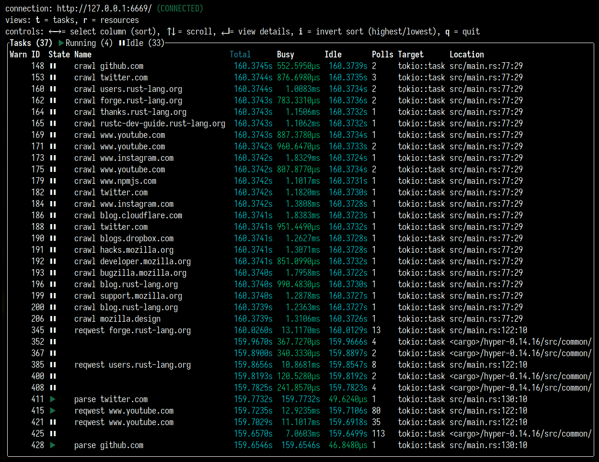
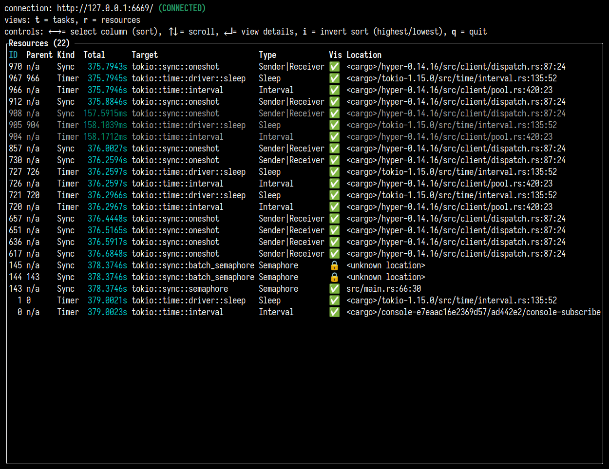
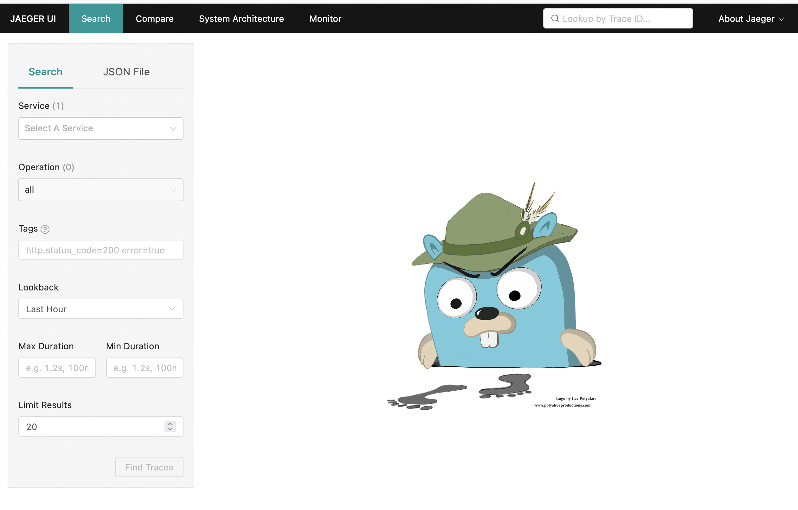
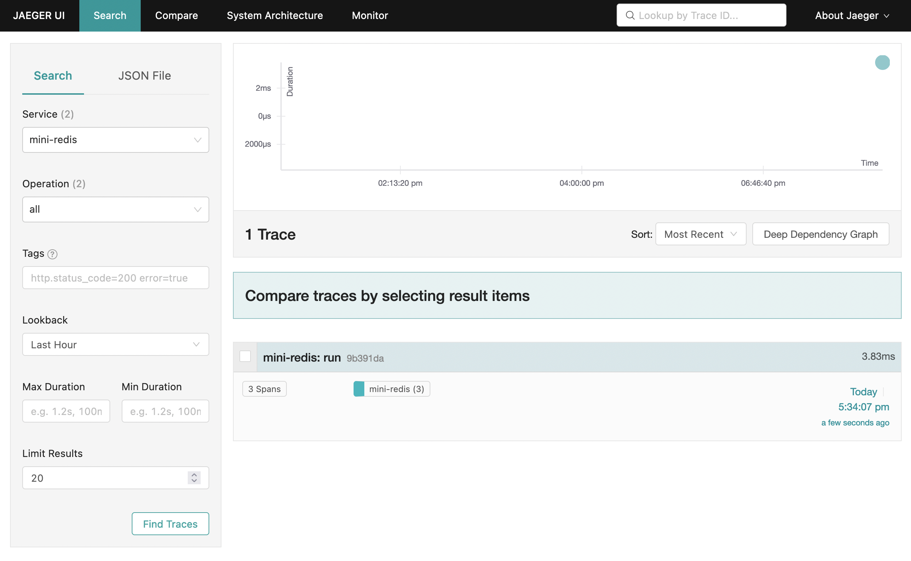
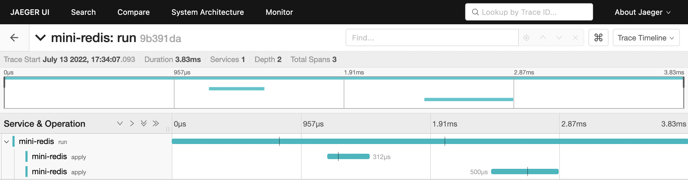

# Next steps with Tracing

## Tokio-console

[`tokio-console`](https://github.com/tokio-rs/console) 是一种类似于 HTOP 的工具，使您可以看到应用程序 span 和事件的实时视图。它还可以表示 Tokio 运行时创建的“资源”，例如任务。这对于理解开发过程中的性能问题至关重要。

例如，要在 [Mini-Redis项目](https://github.com/tokio-rs/mini-redis) 中使用 Tokio-Console，您需要启用 Tokio 软件包的 `tracing` feature：

```rust
# Update the tokio import in your Cargo.toml
tokio = { version = "1", features = ["full", "tracing"] }
```

注意：`full` feature 无法启用 `tracing`。

您还需要添加 `console-subscriber` 依赖。该 crate 提供了一个 `Subscriber` 实现，将取代 Mini-Redis 当前使用的 subscriber：

```rust
# Add this to the dependencies section of your Cargo.toml
console-subscriber = "0.1.5"
```

最后，在 `src/bin/server.rs` 中，用调用 `console-subscriber` 替换 `tracing_subscriber` 的调用：

替换：

```rust
tracing_subscriber::fmt::try_init()?;
```

为：

```rust
console_subscriber::init();
```

这将启用 `console_subscriber`，这意味着将记录与 `tokio-console` 相关的任何仪器。仍将记录到 stdout（基于 `RUST_LOG` 环境变量的值）。

现在我们应该准备好再次启动 mini-redis，这次使用 `tokio_unstable` 标志（启用跟踪需要）：

```shell
RUSTFLAGS="--cfg tokio_unstable" cargo run --bin mini-redis-server
```

`tokio_unstable` 标志允许我们使用 Tokio 提供的当前无法保证稳定性的附加 API（换句话说，允许对这些 API 进行重大更改）。

剩下的就是在另一个终端中运行控制台本身。最简单的方法是从 crates.io 安装它：

```shell
cargo install --locked tokio-console
```

然后使用：

```shell
tokio-console
```

您将看到的初始视图是当前正在运行的 tokio 任务。例如：



它还可以在任务完成后的一段时间内显示任务（任务的颜色为灰色）。您可以通过运行 mini-redis hello world 示例（可在 [mini-redis repository](https://github.com/tokio-rs/mini-redis) 中找到）来生成一些跟踪：

```shell
cargo run --example hello_world
```

如果按 `r` ，则可以切换到资源视图。这显示了 Tokio Runtime 使用的信号量，mutexes 和其他结构。例子：



每当您需要反省 Tokio 运行时以更好地了解应用程序的性能时，您都可以使用 tokio-console 查看实时发生的情况，帮助您发现死锁和其他问题。

要了解有关如何使用Tokio-Console的更多信息，请访问[其文档页面](https://docs.rs/tokio-console/latest/tokio_console/#using-the-console)。

## Integrating with OpenTelemetry

[OpenTelemetry](https://opentelemetry.io/) (OTel) 有多重含义；首先，它是一种开放规范，定义了可以满足大多数用户需求的跟踪和指标数据模型。它也是一组特定于语言的 SDK，提供检测以便可以从应用程序发出跟踪和指标。第三，还有 OpenTelemetry Collector，这是一个与您的应用程序一起运行的二进制文件，用于收集跟踪和指标，最终将它们推送给遥测供应商，例如 DataDog、Honeycomb 或 AWS X-Ray。它还可以将数据发送到 Prometheus 之类的工具。

[opentelemetry crate](https://crates.io/crates/opentelemetry) 为 Rust 提供了 OpenTelemetry SDK，我们将在本教程中使用它。

在本教程中，我们将设置 mini-redis 以将数据发送到 [Jaeger](https://www.jaegertracing.io/)，这是一个用于可视化跟踪的 UI。

要运行 Jaeger 实例，您可以使用 Docker：

```shell
docker run -d -p6831:6831/udp -p6832:6832/udp -p16686:16686 -p14268:14268 jaegertracing/all-in-one:latest
```

你可以通过 http://localhost:16686 访问 Jaeger 页面。它看起来如下：



一旦我们生成并发送了一些跟踪数据，我们就会回到此页面。

要设置 mini-redis，我们首先需要添加一些依赖项。使用以下内容更新您的 `Cargo.toml`：

```rust
# Implements the types defined in the Otel spec
opentelemetry = "0.17.0"
# Integration between the tracing crate and the opentelemetry crate
tracing-opentelemetry = "0.17.2" 
# Allows you to export data to Jaeger
opentelemetry-jaeger = "0.16.0"
```

现在，在 src/bin/server.rs 中，添加以下导入项：

```rust
use opentelemetry::global;
use tracing_subscriber::{
    fmt, layer::SubscriberExt, util::SubscriberInitExt,
};
```

我们马上就会看看它们各自起什么作用。

下一步是用 OTel 设置替换对 `tracing_subscriber` 的调用。将：

```rust
tracing_subscriber::fmt::try_init()?;
```

替换为

```rust
// Allows you to pass along context (i.e., trace IDs) across services
global::set_text_map_propagator(opentelemetry_jaeger::Propagator::new());
// Sets up the machinery needed to export data to Jaeger
// There are other OTel crates that provide pipelines for the vendors
// mentioned earlier.
let tracer = opentelemetry_jaeger::new_pipeline()
    .with_service_name("mini-redis")
    .install_simple()?;

// Create a tracing layer with the configured tracer
let opentelemetry = tracing_opentelemetry::layer().with_tracer(tracer);

// The SubscriberExt and SubscriberInitExt traits are needed to extend the
// Registry to accept `opentelemetry (the OpenTelemetryLayer type).
tracing_subscriber::registry()
    .with(opentelemetry)
    // Continue logging to stdout
    .with(fmt::Layer::default())
    .try_init()?;
```

现在你应该可以启动 mini-redis 了：

```shell
cargo run --bin mini-redis-server
```

在另一个终端中，运行 hello world 示例（可以在 [mini-redis repository](https://github.com/tokio-rs/mini-redis)中找到）：

```rust
cargo run --example hello_world
```

现在，刷新我们打开的 Jaeger UI，并在主搜索页面上，在服务下拉菜单中找到“mini-redis”作为选项之一。

选择该选项，然后单击“Find Traces”按钮。这将显示我们刚刚运行示例时发出的请求。



单击 trace 应该会向您显示在处理 hello world 示例期间发出的 spans 的详细视图。



现在就这样了！您可以通过发送更多请求、为 mini-redis 添加其他仪器或与遥测供应商一起设置 OTel（而不是我们在本地运行的 Jaeger 实例）来进一步探索这一点。对于最后一个，您可能需要引入一个额外的包（例如，要将数据发送到 OTel Collector，您需要 `opentelemetry-otlp` crate）。[opentelemetry-rust repository](https://github.com/open-telemetry/opentelemetry-rust/tree/main/examples)中有许多示例。

注意：mini-redis repo 已经包含带有 AWS X-Ray 的 OpenTelemetry 的完整示例，其详细信息可以在 [`README`](https://github.com/tokio-rs/mini-redis#aws-x-ray-example) 以及 [`Cargo.toml`](https://github.com/tokio-rs/mini-redis/blob/24d9d9f466d9078c46477bf5c2d68416553b9872/Cargo.toml#L35-L41) 和 [`src/bin/server.rs`](https://github.com/tokio-rs/mini-redis/blob/24d9d9f466d9078c46477bf5c2d68416553b9872/src/bin/server.rs#L59-L94) 文件中找到。
